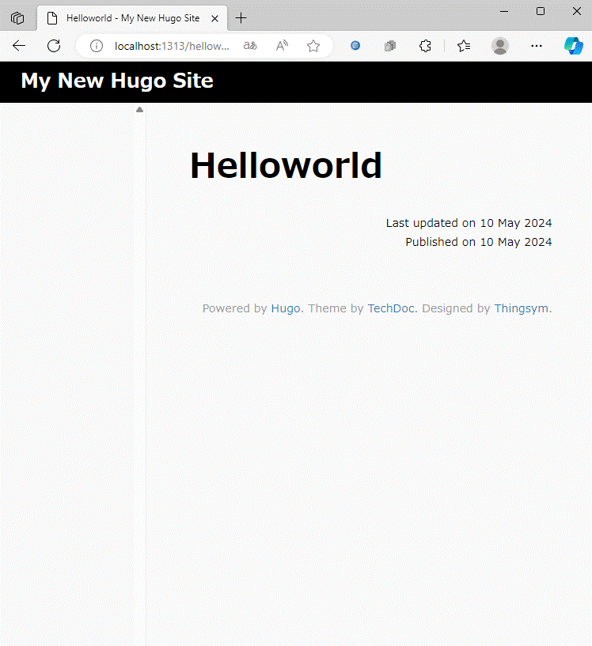

# ここでわかること
* VS Codeのdevcontainer機能でクリーンなhugo環境の構築

# 構成 Layout


# 事前準備(作業内容割愛)
* Dockerが動く環境 ... 今回はUbuntu(VirtualMachine)を使います。WSLでも可
* VScodeが接続するユーザでdockerコマンドが実行できること
* VSCodeの拡張機能にWSLもしくはRemoteSSHとdevcontainerを追加

# Hugo環境構築
### 1. devcontainer関連ファイルを設置 on Ubuntu
devcontainerテンプレートをmicrosoftリポジトリから取得して配置(gitの一部clone[sparseclone])
```bash
git clone --no-checkout --depth=1 https://github.com/microsoft/vscode-dev-containers.git
cd vscode-dev-containers
git sparse-checkout init
git sparse-checkout add containers/hugo
git checkout
```
git checkoutすると必要なファイルだけ取得できました


devcontainer関連ファイルをhugo作業フォルダとして複製し、gitリポジトリを削除します
```bash
mv containers/hugo ../
rm -rf ../vscode-dev-containers
```

### 2. Hugo DevContainerの起動(on VSCode)
VSCode Remote SSH or WSLでUbuntuへ接続し、コンテンツフォルダをワークスペースに追加
```
[ファイル] > [ワークスペースにフォルダを追加] > hugo/
```


ワークスペースに名前をつけて保存(devcontainer起動に必須)
```
[ファイル] > [名前を付けてワークスペースに保存]
```

devcontainer機能でDockerイメージの作成、及びHugo devcontainerへ接続すると、dockerイメージがビルドされ、devcontainerへVSCodeが再接続します

```
[左下の接続バー] > [コンテナを再度開く]
```


左下の接続バーが`[開発コンテナ: Hugo(Community)]`になっていれば成功です


### 3. 初期コンテンツを作成(on Hugo Devcontainer)
VSCodeのTerminalから以下のコマンドを実行して、テストサイト用Hugoファイル構成を作成します
* 以下の例では/hugo/に直接コンテンツレイアウトを作成します
```bash
hugo new site . --force
```

テストページを作成
```bash
hugo new content helloworld.md
```


テーマファイルを設置
```bash
git init
git submodule add https://github.com/thingsym/hugo-theme-techdoc.git themes/hugo-theme-techdoc
```

設定ファイル(hugo.toml)にテーマを指定
```toml
theme = "hugo-theme-techdoc"
```

### 4. Hugo Serverを起動して画面表示を行う(on Hugo Devcontainer)
VS CodeがDevcontainerの1313番ポート(default)とローカル端末のlocalhost:1313をポートフォワードしている。
よって、ローカル端末のブラウザでHugoサーバへアクセスし画面の確認が可能

```
[ターミナル > [タスクの実行] > [Serve Draft]を選択し実行
```


http://localhost:1313/helloworld/へアクセスしてコンテンツを確認



# 参考情報
* devcontainerリポジトリ: https://github.com/microsoft/vscode-dev-containers/tree/main/containers/hugo
