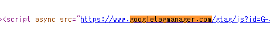

# 概要

HugoのGoogle Analytics 4への対応方法はいろいろな記事に記載されているが、公式サイトに記載されているガイドに沿って対応する

※この記事ではThemeにPaperModを利用している為、その他のThemeによっては設定する内容が異なる可能性があります。

# 執筆時点のHugo及びTheme Version

* Hugo: 0.120.4
* PaperMod: v7.0

# このページでわかること

* 公式サイトの解説ガイドに沿ったHugoのGoogle Analytics 4対応

# 参考サイト

* Hugo Templates > Internal templates
  * https://gohugo.io/templates/internal/

# 1. ディレクトリ構成

* 今回修正するファイルは以下になります
```
- /
  - hugo.toml
  - layouts/
    - partials/
      - extend_head.html
```

# 2. 実装手順

### 2-1. hugo設定ファイルへGoogle Analytics 4 ID設定

* 公式ガイドに沿ってhugo.tomlへGoogle Analytics 4のIDを設定します

* hugo.toml or config.toml
```
[services]
  [services.googleAnalytics]
    ID = 'G-xxxxxxxxxx'
```

### 2-2. extend_head.html(Theme: PaperModの場合)を上書きする

* 全てのページへ反映する為、extend_head.htmlを修正する_internal/google_analytics.htmlを読み込む設定を記載

* layouts/partials/extend_head.html
```
{{ template "_internal/google_analytics.html" . }}
```

# 3. 反映確認

* Hugoの各ページのソースを確認し、googletagmanager.comのタグが追記されていることを確認


