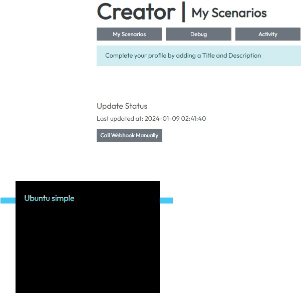
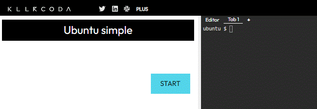
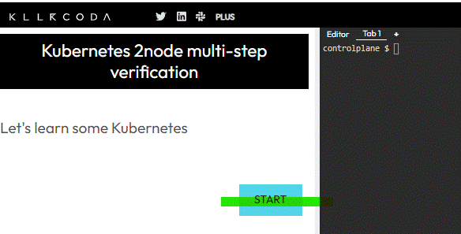
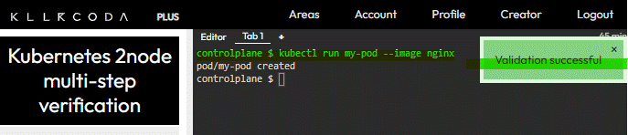
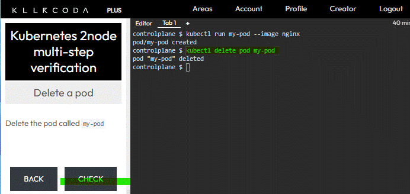
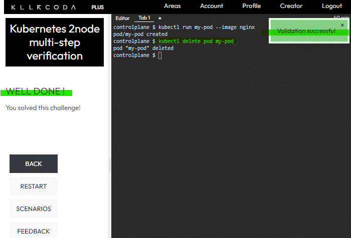

# 概要

```
KillerCodaはあらかじめ登録されたProfile以外に自分のGithubリポジトリを同期し、オリジナルのプロファイルを読み込ませることができます。
その手順を紹介します。
```

[前回](https:/blog.1mg.org/posts/killercoda/setup/)ではKillerCodaと自身のGithubリポジトリの同期設定を行いましたので、ここでは実際にシナリオ作成を行っていきます。

# このページでわかること
* KillerCodaの一番シンプルなシナリオ作成方法
* 公式に公開されているサンプルで、複数ページの構成方法
* verify機能の確認

# 1. 一番シンプルなシナリオ

### 1-1. １ページだけのシンプルなシナリオ

* https://killercoda.com/creators に記載されているOSイメージを起動するだけの一番シンプルなシナリオを作成してみます。

### 1-2. ディレクトリ構成

* 各シナリオはディレクトリ単位で分割します。
* 最小構成はindex.jsonのみで構成が可能です。
  ```
  - /
    - scenario01/
      - index.json
  ```

### 1-3. index.jsonの各パラメータ

* title: 記載した情報がKillerCodaで表示されるシナリオ名になります
* imageid: creatorsページのEnvironmentsに記載されているイメージを利用することができます
  ```
  {
    "title": "Ubuntu simple",
    "backend": {
        "imageid": "ubuntu"
    }
  }
  ```

### 1-4. Githubリポジトリへアップロードし反映
* サンプルプログラムの一部クローン方法を記載しておきます
```
git clone --filter=blob:none --sparse https://github.com/killercoda/scenario-examples.git
git sparse-checkout set kubernetes-2node-multi-step-verification
```

* 上記構成をGithubへpushすると、GithubのpushイベントによりKillerCodaへwebhookが実行され、KillerCoda側からGithubのリポジトリの情報が取得されます。


* Ubuntu simpleシナリオに移動するとUbuntuが立ち上がりました。


# 2. Kubernetesサンプルシナリオを作成
### 2-1. kubernetesサンプルシナリオ作成
* https://killercoda.com/creatorsに記載されているkubernetesサンプルシナリオを参考に、複数ページ構成による学習コンテンツを作成します。
* 公開されているサンプルコンテンツのリポジトリは以下になります。
  * https://github.com/killercoda/scenario-examples/tree/main/kubernetes-2node-multi-step-verification

### 2-2. index.jsonの構成
* index.jsonのdetailsでは"intro", "steps", "finish"の３構成に分かれています。
* introとfinishは１ファイルしかMarkdownファイルを呼び出せませんが、まstepsは複数のMarkdownファイルを呼び出すことができます。
```
{
  "title": "Kubernetes 2node multi-step verification",
  "description": "Uses a two node Kubernetes cluster and performs user input verification in all steps",
  "details": {
    "intro": { // 初回に呼び出される
      "text": "intro.md"
    },
    "steps": [
      {
        "title": "Create a pod",
        "text": "step1/text.md",
        "verify": "step1/verify.sh"
      },
      {
        "title": "Delete a pod",
        "text": "step2/text.md",
        "verify": "step2/verify.sh"
      }
    ],
    "finish": { // 最後に呼び出される
      "text": "finish.md"
    }
  },
  "backend": { // イメージを指定
    "imageid": "kubernetes-kubeadm-2nodes"
  }
}
```

### 2-2. ディレクトリ構成
```
- /
  - kubernetes-2node-multi-step-verification/
    - step1/ // 各ステップ
      - text.md
      - verify.sh // step1で実施した結果をチェックするシェルスクリプト
    - step2/
      - text.md
      - verify.sh
    - finish.md
    - index.json // 構成ファイル 
    - intro.md // 初期表示ページ
```

### 2-3. 実行(intro)
* 上記サンプルをGithubにPushし、実際の動きを確認します

* introにはintro.mdを読み込む指定が行われております。
  ```
    "details": {
      "intro": {
        "text": "intro.md"
      },
  ```

* introでは自動的に[Start]が表示され、Stepに移動します


### 2-4. 実行(Step1)
* Step1ではkubernetesのmy-podというpodを作成する必要があり、verifyが指定されていますので[CHECK]が表示されます。
* また、[CHECK]を押すとverify:で指定したプログラム(ここではverify.sh)が実行され、結果が0であればOKとなります。

* 実際にmy-podを作成する為、以下のコマンドを実行します
```
kubectl run my-pod --image nginx 
```

* podの作成が完了したあと、[CHECK]を実行すると、Successのメッセージとともに、Step2に移動します


### 2-4. 実行(Step2)
* Step2では先ほど作成したmy-podを削除しますので、以下のコマンドを実行します
```
kubectl delete pod my-pod
```



* [CHECK]を実行すると、Verification Successのメッセージとともに、finishに移動します

