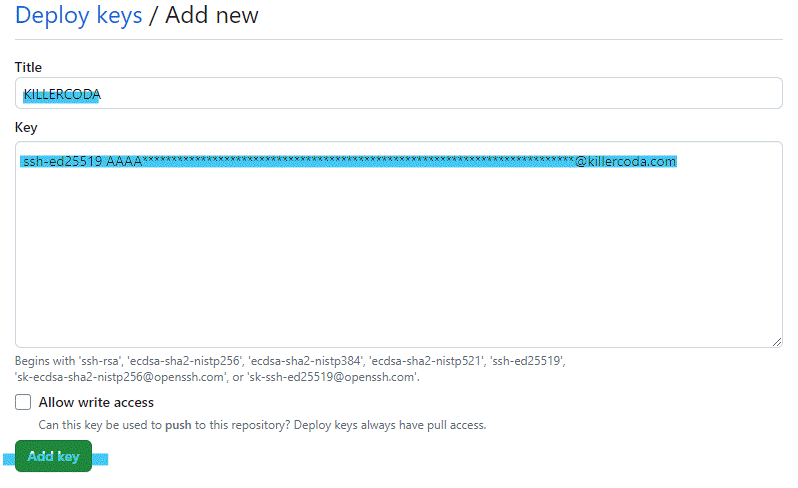

# 概要
```
KillerCodaはあらかじめ登録されたProfile以外に自分のGithubリポジトリを同期し、オリジナルのプロファイルを読み込ませることができます。
その手順を紹介します。
```

# 流れ
1. Githubにリポジトリを作成(文中では省略)
2. KillerCodaにアカウントを作成(文中では省略)
3. GithubのリポジトリをKillerCodaに登録
4. KillerCodaで発行されたDeployKeyを、Githubリポジトリへ登録
5. KillerCodaで発行されたWebhookを、Githubリポジトリへ登録
6. KillerCodaとGithubリポジトリの同期確認

# 3. GithubのリポジトリをKillerCodaに登録

* KillerCodaへログインし、[Creater]>[Repository]へ移動します。
* Step1: で以下の図のようにRepoName: 及び Branch:にKillerCodaと同期したいGithubリポジトリの情報を登録します。
  

# 4. KillerCodaで発行されたDeployKeyを、Githubリポジトリへ登録

* Step2に記載されているDeploy Keyをコピーします
  
* Githubで自身のリポジトリの[Settings]>[Deploy Keys]>[Add Deploy Key]へ移動し、先ほどコピーしたDeploy Keyを登録します。
  

# 5. KillerCodaで発行されたWebhookを、Githubリポジトリへ登録

* Step3に記載されているWebhook URL及びSecretをコピーします
  
* Githubで自身のリポジトリの[Settings]>[Webhooks]>[Add Webhook]へ移動し、先ほどコピーしたWebhookURL、Secretを登録します。
  
* Webhook登録完了後に、登録したWebhookの左端にチェックがつき、Successfulのメッセージが表示されていれば問題なくWebhookがKillerCodaに飛んでいます。
  

# 6. KillerCodaとGithubリポジトリの同期確認

* KillerCodaへログインし、[Creater]>[MyScenarios]へ移動します。
* Update Statusの時刻が最新化されていれば成功です。
  

[次の記事](https:/blog.1mg.org/posts/killercoda/create_scenario/)ではオリジナルシナリオを作ります。
