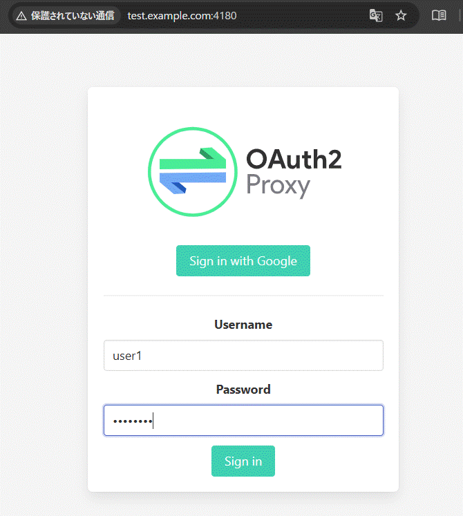
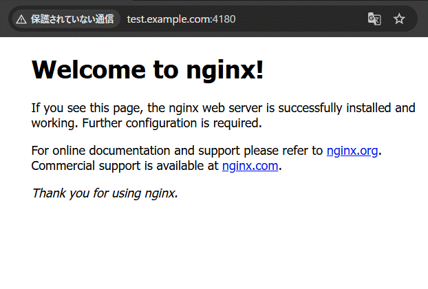

# このページでわかること
* Nginxのトップページに対してOAuth2-ProxyのBasic認証を経由してアクセスする

# Killercoda URL
この記事の内容はKillercodaにて学習コンテンツとして公開しております。
併せて、動作確認で利用してください。

URL: https://killercoda.com/ijikeman/scenario/oauth2-proxy

## Oauth2-Proxyの認証機構としてBasic認証でテスト実行してみる
* .htpasswdを発行する
```
PASSWD=`printf "P@ssw0rd" | openssl dgst -binary -sha1 | openssl base64`
echo "admin:{SHA}$PASSWD" > /etc/oauth2-proxy/.htpasswd
```

* OAuth2-Proxyの設定ファイルの修正
```
vi /etc/oauth2-proxy/oauth2-proxy.cfg
```

* 末尾に追記
```
echo '# Basic Auth(※新しく追記)' >>  /etc/oauth2-proxy/oauth2-proxy.cfg
echo 'htpasswd_file = "/etc/oauth2-proxy/.htpasswd" # Basic認証用パスワードのパスを指定' >> /etc/oauth2-proxy/oauth2-proxy.cfg
```

## Backendの準備
* nginxを8080番で起動してOAuth2-Proxyの接続後の仮サイトとする
```
docker run --rm --name nginx -p 8080:80 -itd nginx:latest
```

* OAuth2-Proxyを起動し、Basic認証ファイルが読み込まれていることを確認
```
systemctl restart oauth2-proxy
```

```
[2025/12/08 09:39:05] [oauthproxy.go:128] using htpasswd file: /etc/oauth2-proxy/.htpasswd
[2025/12/08 09:39:05] [watcher.go:40] watching '/etc/oauth2-proxy/.htpasswd' for updates
[2025/12/08 09:39:05] [proxy.go:89] mapping path "/" => upstream "http://127.0.0.1:8080"
```

* https://IP:4180にブラウザからアクセスし、OAuth2-Proxyのページが表示されることを確認



* Basic認証で発行したユーザパスワードを入力すると、nginxの画面が表示される



* 認証時のOAuth2-ProxyのログにBasic認証が表示されていることが確認できる
```
192.168.0.1:50640 - - user1 [2025/12/01 00:00:00] [AuthSuccess] Authenticated via HtpasswdFile
192.168.0.1:50640 - - - [2025/12/01 00:00:00] test.example.com:4180 POST - "/oauth2/sign_in" HTTP/1.1 "Mozilla/5.0 (Windows NT 10.0; Win64; x64) AppleWebKit/537.36 (KHTML, like Gecko) Chrome/142.0.0.0 Safari/537.36" 302 0 0.004
192.168.0.1:50640 - - user1 [2025/12/01 00:00:00] test.example.com:4180 GET / "/" HTTP/1.1 "Mozilla/5.0 (Windows NT 10.0; Win64; x64) AppleWebKit/537.36 (KHTML, like Gecko) Chrome/142.0.0.0 Safari/537.36" 200 615 0.001
```
