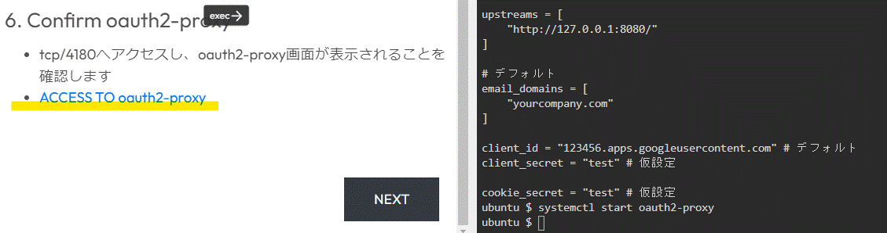
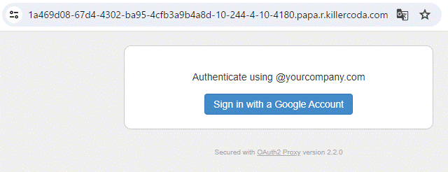

# このページでわかること

* oauth2-proxyの起動と画面の確認まで(基本設定)

# 執筆時の環境とバージョン
* Ubuntu: 22.04
* oauth2-proxy: 2.2.0

# 参考サイト

* oauth2-proxy公式リポジトリ
  * https://github.com/oauth2-proxy/oauth2-proxy

* oauth2-proxyの公式ドキュメント
  * https://oauth2-proxy.github.io/oauth2-proxy/docs/

# Killercoda URL
この記事の内容はKillercodaにて学習コンテンツとして公開しております。
併せて、動作確認で利用してください。

URL: https://killercoda.com/ijikeman/scenario/oauth2-proxy

# 1. 基本設定による起動確認
## 1-1. ファイル/ディレクトリ構成

* 今回ファイル/ディレクトリ構成は以下になります
```
- /
  - usr/local/bin/
    - oauth2-proxy ... oauth2-proxyバイナリ
  - etc/
    - oauth2_proxy.cfg ... oauth2-proxy設定ファイル
  - usr/lib/systemd/system/
    - oauth2_proxy.servce ... systemd管理サービスファイル
```

## 1-2. インストール
* oauth2-proxyバイナリのダウンロード
```
VERSION_OAUTH2=2.2.0
VERSION_GO=1.8.1
FILENAME_OAUTH2="oauth2_proxy-${VERSION_OAUTH2}.linux-amd64.go${VERSION_GO}"

wget https://github.com/bitly/oauth2_proxy/releases/download/v`echo ${VERSION_OAUTH2%.*}`/${FILENAME_OAUTH2}.tar.gz -O /tmp/oauth2-proxy.tar.gz
tar zxvf /tmp/oauth2-proxy.tar.gz -C /tmp
mv /tmp/${FILENAME_OAUTH2}/oauth2_proxy /usr/local/bin/
chmod +x /usr/local/bin/oauth2_proxy
```

* 設定ファイルサンプルのダウンロード
```
wget https://raw.githubusercontent.com/bitly/oauth2_proxy/v`echo ${VERSION_OAUTH2%.*}`/contrib/oauth2_proxy.cfg.example -O /etc/oauth2_proxy.cfg
```

* systemd管理Serviceファイルのダウンロード
```
wget https://raw.githubusercontent.com/bitly/oauth2_proxy/v`echo ${VERSION_OAUTH2%.*}`/contrib/oauth2_proxy.service.example -O /usr/lib/systemd/system/oauth2_proxy.service
```

## 1-3. 設定ファイル修正(仮)
* oauth2_proxy.cfgの以下の部分を修正します(最低限の設定と起動確認のみ)

```
http_address = "0.0.0.0:4180" # グローバルIPでListenできるように変更

upstreams = [
    "http://127.0.0.1:8080 # 一旦デフォルトのまま
]

email_domains = [
    "yourdomain.com" # 一旦デフォルトのまま
]

client_id = "123456.apps.googleusercontent.com" # 一旦デフォルトのまま
client_secret = "test" # 空欄だと起動時にエラーになる
cookie_secret = "test"
```

## 1-4. oauth2-proxyの起動
```
systemctl start oauth2_proxy.service
```

## 1-5. oauth2-proxyの画面確認
* http://$IP:4180にアクセスし、oauth2-proxyの認証画面が表示されることを確認(以下はkillercodaを使って確認しています)





こちらの[記事](/content/posts/oauth2-proxy/setup_google_auth/)にてGoogle認証に必要な設定を行っていきます
