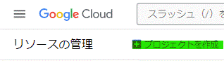
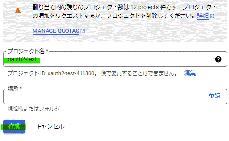

# 2. Google認証
ここからはoauth2-proxyでGoogle認証に必要な設定を行っていきます

## 2-1. Cookie用シークレットの発行
* oauth2-proxy.cfgへ設定するCookie用シークレットの発行を行います

* [Document](https://oauth2-proxy.github.io/oauth2-proxy/docs/configuration/overview/#generating-a-cookie-secret)に沿って、以下のコマンドで発行します
```
python -c 'import os,base64; print(base64.urlsafe_b64encode(os.urandom(32)).decode())'
```

## 2-2. Google認証用IDの発行
* 公式ガイドに沿ってGoogle認証用のIDを発行します

* https://console.developers.google.com/project へアクセスし、new projectを選択します



* project作成で[oauth2-test] を作成する



* 左の三本線(三)からAPIとサービス>認証情報を選択します


* Oauth同意画面のタブを選択し、Oauth2クライアントIDを選択します


* Webアプリケーションを選択し、認証に利用したいURLを入力します。ここではhttp://example.com/oauth2/callbackと入力します


* 作成を選択します


