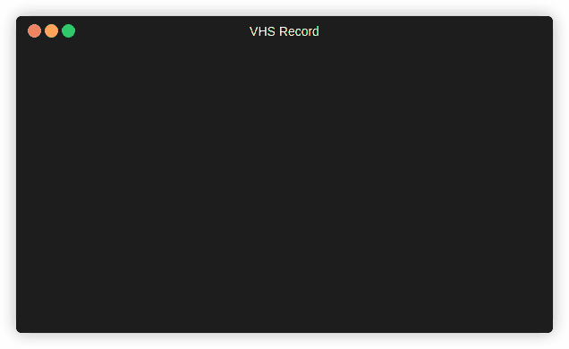
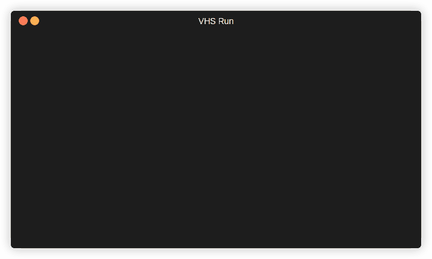
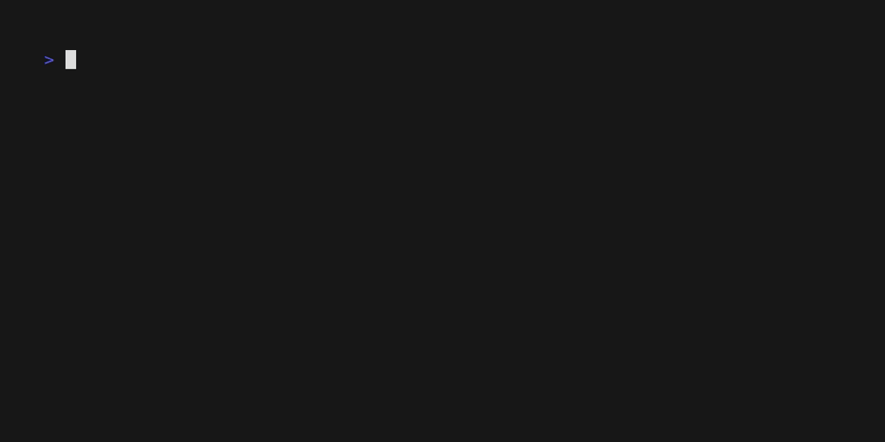

# この記事でわかること
* .tapeファイルの構成
* .tapeファイルを実際に入力して作成する場合
* .tapeファイルに出力設定を行う
* .tapeファイルを実行する

### vhsの簡単な使い方
1. tapeファイルテンプレートの作成

```bash
vhs new sample.tape
```

```Plaintext
Created sample.tape
```

2. .tapeファイルを編集する

```bash
vi sample.tape
```

3. 構文チェック

```bash
vhs validate sample.tape
```

4. .tapeファイルを実行する

```bash
vhs < sample.tape
```

### .tapeファイルの構成
*.tapeファイルの内容は以下のようになります。
```
Output example.gif
Type "echo 'Welcome to VHS!'" # 実行したいコマンドを設定
Sleep 500ms # 500ミリ秒待機
Enter 1 # Enterキーを押す
Sleep 5s # 5秒待機
```

### .tapeファイルを実際に入力して作成する場合
recordコマンドを使用することで、.tapeファイルを編集せずに実際にターミナルを操作して作成できます。
```bash
vhs record > sample.tape
---
ここに実行したいコマンドを実行する

Ctrl + C で終了
```

実行すると以下の様子になり実行したコマンドがsample.tapeに保存されます。



### .tapeファイルに出力設定を行う
```bash
# 行頭にOutput設定を追加する
sed -i '1i Output sample.gif' sample.tape
```

### .tapeファイルを実行する

```bash
vhs < sample.tape
```

実行すると以下の様子になり、vhsの実行が完了すると設定したコマンドを実行したgifが生成されます。


生成されたsample.gifは以下になります。


# 関連記事
* [VHSのインストール](/posts/vhs/install/)
* [VHSの設定ファイル編集](/posts/vhs/config/)
