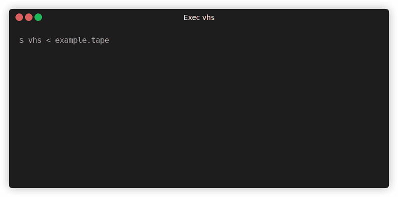

# このページでわかること
* ターミナル操作を自動録画する「VHS」のUbuntuへの導入手順
* VHS実行時のChromium/Sandboxエラーの回避方法

---
# 経緯
今までターミナルのキャプチャーをWindowsのSnipping Toolを使ってたが、コマンド失敗時の取り直し等
時間がかかるので、調査したところVHSなるものを見つけたので調査検証した結果を残しておく。

## 執筆時の環境とバージョン
* Ubuntu: 22.04
* VHS: v0.10.0

## 公式
* [Githubリポジトリ](https://github.com/charmbracelet/vhs)

## 環境構築

### 1. デモ動画作成ツール「VHS」の導入 (Ubuntu 22.04)
ターミナル操作を自動化し、GIFアニメーションとして記録できるVHSをインストールします。

* 依存パッケージ(ttydとffmpeg)のインストール
```Bash
sudo apt update
sudo apt install -y ttyd ffmpeg
```

### 2. Chromiumのインストール
VHS実行時、初回ブラウザインストール後に以下のエラーが発生することがあります。
このエラーを回避するため、システムにChromiumを明示的にインストールする必要があります。

```Plaintext
could not launch browser: [launcher] Failed to get the debug url: ... No usable sandbox!
```

* Chromiumのインストール方法
以下のいずれかの方法でインストールします。

[debパッケージから（Google Chrome）]
```Bash
wget https://dl.google.com/linux/direct/google-chrome-stable_current_amd64.deb -O /tmp/google-chrome-stable.deb
sudo apt install /tmp/google-chrome-stable.deb -y
```

[Snapからインストール]
```Bash
sudo snap install chromium --classic --channel latest/stable
```

### 3. コンパイル済みvhsバイナリを設置

```Bash
VERSION=0.10.0

wget https://github.com/charmbracelet/vhs/releases/download/v${VERSION}/vhs_${VERSION}_Linux_x86_64.tar.gz -O /tmp/vhs.tar.gz
tar zxvf /tmp/vhs.tar.gz -C /tmp/
sudo mv /tmp/vhs_${VERSION}_Linux_x86_64/vhs /usr/local/bin/
```

### 4. 動作確認
```
vhs --help
```

### 5. サンプル実行
サンプル用.tape ファイルを作成して実行します。
```Bash
# .tapeサンプルの新規作成
vhs new example.tape

# 実行
vhs < example.tape 
```

実行ログ:
```Plaintext
Output .gif example.gif
Require echo
Set Shell bash
Set FontSize 32
Set Width 1200
Set Height 600
Type echo 'Welcome to VHS!'
Sleep 500ms
Enter 1
Sleep 5s
Creating example.gif
```

この画像は別のツール(terminalizer)で作ってます。


作成してできた画像はこちら


次は以下の記事にて設定ファイル(.tape)の記事を作成します
* [VHS(設定ファイル編)](/posts/vhs/config/)
